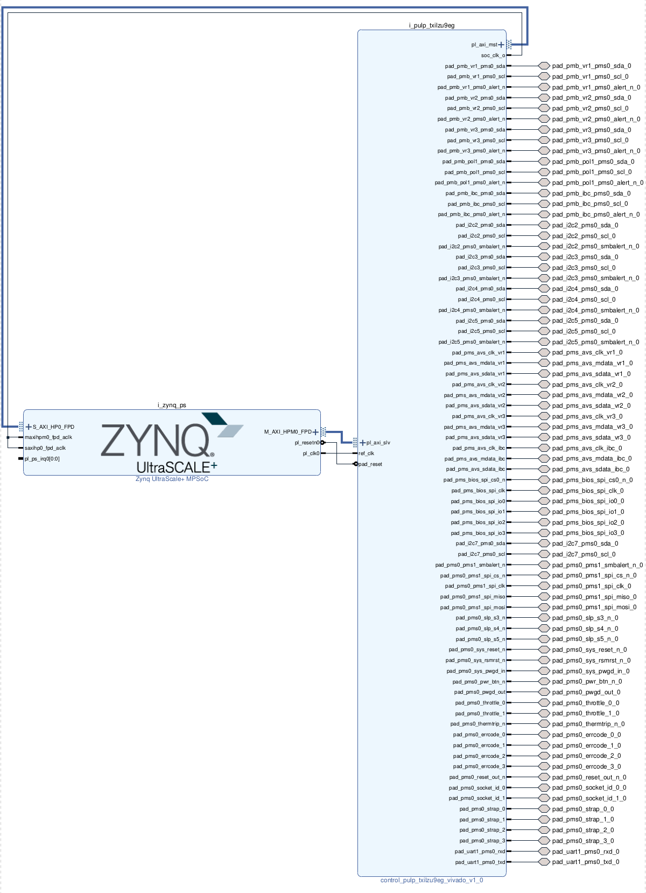

# Control PULP - FPGA port

This is the root directory for the implementation of the EPI1 Power Management Subsystem (PMS), here named Control PULP, on the Xilinx Zynq Ultrascale+ MPSoC ZCU102 board. The FPGA mapping proceeds as follows:

1. The Control PULP design is packaged as an IP using the Vivado IP packager tool. Afterwards, it is added to the Vivado IP catalogue;
2. The Control PULP IP is instantiated in a Vivado block design (BD) as external IP along with the Zynq Processing Systems (`PS`), an SoC that hosts four ARM Cortex-A53 cores. The two IPs are interfaced via AMBA AXI4 protocol,
one for each direction



**Note:** The FPGA emulation simplifies the actual Rhea chip ASIC design. There, Control PULP (Power Management Subsystem, PMS) exposes its internal AXI ports towards a hierarchy of NoCs (`nci_cp_top`) through which it can interact with the ARM cores of the chip.
On FPGA:

- The controlled HPC cores and on-chip logic outside the PMS are not emulated;
- The PMS interacts with the Zynq Processing System (PS) directly with AXI connection (no crossbar/NoC hierarchy is present);
- The PS side emulates the HPC cores in software, closing the Control Loop and defining the HW-in-the-loop emulation;
- Off-chip communication of Rhea (for FPGA, the PMS only) with BMC and VRMs is emulated with EVLPT (EPI Light Reference Platform Board), which is connected to the Zynq ZCU102 FPGA through HPC/FMC connectors.

## RTL wrapper and RTL simulation

In the framework of the FPGA implementation, the very same connection from the ASIC domain is emulated via the interaction between Control PULP (or `PL`, i.e. Programmable Logic) and the Zynq PS.
For the AXI widths to be matched within the PL-PS bridge, a wrapper which instantiates open source AXI IP converters is employed (`rtl/pulp/control_pulp_fpga.sv`). I/O signals and AXI4 ports are then flattened in the top level module.

Since Xilinx Vivado requires a pure verilog top-level module for implementation, we currently distinguish between:

- `fpga/control_pulp-txilzu9eg/rtl/pms_top_fpga.v`: the verilog top-level used for FPGA mapping;
- `rtl/pulp/pms_top_fpga_behav.sv`: the system verilog top-level module used to simulate the FPGA wrapper with RTL simulations. The latter can be found under `rtl/tb/tbfpga/*`.

## Zynq PS Boot modes

The linux kernel is started on the PS and the Control PULP bitstream programmed accordingly during the process itself.
Two booting ways do exist:

1. *SD card boot*: The SD card should be partitioned and mounted with (a) the linux kernel image (`image.ub`), (b) PL bitstream and PS booting binaries (`BOOT.BIN`) and (c) Linux root filesystem. (a) and (b) are generated with Xilinx Petalinux, while (c) is generated using Buildroot.
Switch `SW6` on the ZCU102 board needs to be setup accordingly.
After the SD card is plugged into the corresponding port on the board, the linux kernel starts automatically and the Control PULP bitstream is programmed in the Programmable Logic side of the FPGA. Kernel output can be
displayed through `minicom`, a terminal emulator for serial communication, as described below.

2. *JTAG boot*: JTAG can be used to load linux images and program the Control PULP bitstream. Switch `SW6` on the ZCU102 board needs to be set up accordingly as well. Xilinx `xsdb` can then be used to start the booting
procedure, thus involving user interaction. Again, the latter can be monitored via a `minicom` session as well, as described below.

## Control PULP Boot modes

Once the linux is running on the Zynq PS, applications can be executed on the Control PULP PL side. Control PULP bring-up is handled in SW from the PS using memory-mapped drivers towards the PMS L2's memory.
Two boot modes are available (find more information about the boot modes under the `boot/` directory [README](https://iis-git.ee.ethz.ch/balasr/control-pulp/-/tree/master/boot#boot-modes)):

1. *JTAG boot*: A useful way to allow flexible debug on FPGA. It employs JTAG as a bridge between OpenOCD and the cores in Control PULP. The compiled binary is then loaded into the SoC L2 through JTAG.
From the Linux shell, the JTAG boot mode for the Control PULP PL can be selected by writing the corresponding `bootsel` register (`bootsel = 2'h1`) through the AXI slave port of Control PULP.
Afterwards, OpenOCD can take over control, load SoC L2 memory with the application binary and let the core exit its busy loop and start fetching instructions afterwards.
**This boot mode has currently to be still implemented and tested on FPGA.**

2. *AXI boot*: An application binary can be loaded into the SoC L2 directly from the Linux shell via memory mapped transactions through the AXI slave port of Control PULP. This mimics the way the PMS is booted in the Rhea chip, ASIC side.
From the Linux shell, the PRELOADED boot mode for the Control PULP PL can be selected by writing the corresponding `bootsel` register (`bootsel = 2'h3`) through the AXI slave port of Control PULP.
The application binary is loaded in the same way, yet all the other bring-up steps are handled from the PS side instead tha. Last, the core is enabled to start fetching instructions from memory.

# Getting Started

## Setup requirements

In Control PULP top-level directory, type:

```
mkdir install
export CPULP_INSTALL=<rootdir_path>/fpga/install
```
This is needed for installing the AArch64 toolchain.

## Generate bitstream and Hardware Design File (HDF) files

In order to package the Control PULP IP, build the block design with Zynq PS and synthesize/implement it towards bitstream and HDF generation, from the root directory (`fpga/`) type:

```
# generic vivado installation
make zcu102-bitstream
# or on ETH machines (selecting the right VIVADO version)
make zcu102-bitstream VIVADO='vitis-2019.2 vivado'
```

Type `make help` to display the sub-targets executed in the previous Makefile call.

The generated bitstream is available under:

```
fpga/output/pms.bit
```

While the HDF lies under:

```
fpga/output/pms.hdf
```

Note that for Linux-based bringup the bitstream is uploaded to the board along with the PS booting binaries. Therefore, the `bitstream` itself is not used standalone.

## Generate Linux booting images

The Linux kernel can be started on the ARM Processing System using Xilinx Petalinux. The images generation process takes the `bitstream` and `HDF` obtained from the previous section
and generates the binaries needed to start the kernel and program the FPGA with te Control PULP bitstream. In the `fpga/` directory, type:

```
make zcu102-bootimgs
```

The command will create a petalinux project under `petalinux/zcu102`. Booting images can be found under `fpga/output/{BOOT.BIN,image.ub}`.

## Root filesystem

The linux root filesystem is generated using Buildroot. It needs an installed ARM AArch64 toolchain. From the `fpga/` directory, type:

```
make zcu-buildroot
```

The filesystem can be found under `fpga/output/rootfs.tar`

## [Remote connection only] Start HW server connection

If the FPGA board is not connected directly to the development machine, start the connection with the server name and associated port: `<hostname>:<port>` through Petalinux `hw_server` binary:

```
vitis-2020.2 bash hw_server <hostname>:<port>
```

For ETH FPGA remote cluster:

```
ssh <username>@bordcomputer
~zcu102-<FPGA#ID>/hw_server.sh
```
Where `<hostname> = bordcomputer`, and `<port>` is indicated in the `.sh` script.

Where `FPGA#ID` is the number of the board in the cluster (with leading 0 if FPGA#ID < 10).

## Open minicom

A minicom session can be set up to display kernel messages during boot. It is
connected to the PS UART on the FPGA board. There is a minicom configuration
available as `minirc.dfl`. You can use it like this:

```
minicom -D /dev/ttyUSBX minirc.dfl
```

where `X` is the number your usb-to-uart cable is mapped to (can be checked with
e.g. `dmesg`).

For doing this on the ETH FPGA remote cluster:

```
ssh <username>@bordcomputer
tty-zcu102 <FPGA#ID>
```
without leading 0 if FPGA#ID < 10.

## Start the Linux kernel

1. *SD boot*: properly mount the SD (and the associated `SW6` switch on the board). The `minicom` terminal will display the booting process, which starts automatically.

Create two partitions:

- FAT32 (`vfat`), 1 GiB: copy `BOOT.BIN` and `image.ub` in this partition. This partition has to be flagged as "boot" and "esp".
- Linux (`ext4`), remaining space: copy `rootfs.tar` and unzip it inside this partition;
- Properly unmount the SD before unplugging it

Power on the FPGA, the kernel and PMS bitstream programming will start automatically. PMS bitstream download is handled during the FSBL (First Stage Boot Loader) phase of the Linux bring-up.

2. *JTAG boot*:

```
cd fpga/linux/xsdb
./boot_jtag.sh -i <hostname> -p <port>
```

Again, kernel output is displayed in `minicom`.


## Setup Linux

**Note** This step needs to be done the first time the boot is performed. It sets some variables that will be kept at subsequent boot iterations.

While u-boot is starting, in the minicom terminal interrupt the autoboot by pressing any key when asked. Then:

  1. Type printenv to display the environment variables.
  2. Make sure you are using default uboot environment variables. Do do that type `env default -a`.
  3. Type: env save -> write (save) the env variables.
  4. Type: run bootcmd -> resume booting

## Log in to Linux

- Wait for u-boot to end. Once this happens, log in with:

  | Linux log in| Username | Password |
  | ------ | ------ | ------ |
  | Credentials | root | change-this-root-pw |

  This allows accessing the Linux shell on the board.

- Change default password: After the first boot (where the env variables need to be changed as in step 7.), it is suggested to log in using the Username/Password credentials above.
  Afterwards, it may be useful to change the default password for root with a custom one (type passwd).
- Change default user: a new account other than the default root can be created as well.

## Log in to Linux using SSH

This works out of the box. Use the same username and password as given above.
Consider changing your password via `passwd`.

## Update SD card with new bitstream

To update the content of the first partition of the SD card with a new bitstream, type:

```
scp <path_to_images>/{BOOT.BIN,image.ub}
root@<ip_address>:/media/mmcblk0p1
```

and then reboot

```
ssh root@<ip_address> /sbin/reboot
```

## Load and execute applications (PMS FW) on Control PULP

To execute the PMS FW on Control PULP, two prerequisites are needed:

- `pmsctl` the Control PULP boot driver: we use C++ memory mapped library to
access PMS L2 memory from the PMS. It traverses the phases of the PMS boot
assuming the binary executed on the PMS uses Freertos port for PULP platform.
This program is available under `/usr/bin/pmsctl`.


- Control PULP FW binary: PMS FW using FreeRTOS is compiled with a RISC-V
  toolchain. The output binary is converted in a stimuli file that is read by
  the Control PULP boot driver. Type:

```
make fw-compile
```

in `fpga/`

Once the files are generated, they can be send to the board. This assumes that
Linux is running on the board, and SSH access to it is enabled. Type:

```
make fw-upload FPGA_HOSTNAME=your_fpga_hostname
```

## Execute the PMS FW on the FPGA

SSH into the board and execute the FW. Verify that the Firmware image `stim.txt`
is present with `ls` or a similar tool. Afterwards type:

```
ssh root@<ip_address>
pmsctl stim.txt
```
